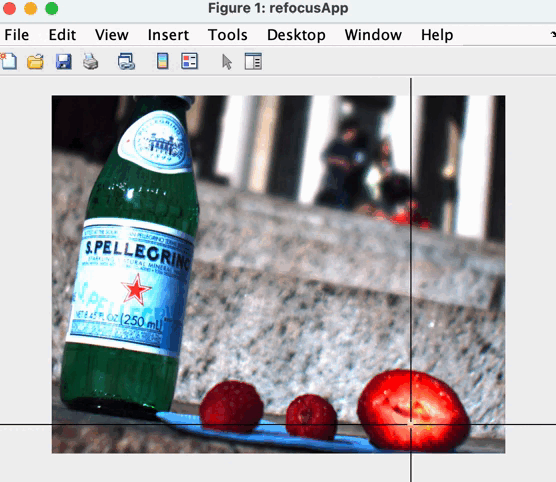

# Refocusing App
An application that allows a user to refocus a scene.

In a conventional image, the focus of a scene is fixed at the time of capture. How can a refocusing app refocus a scene? The trick is that, instead of using a single image, a refocusing app uses a focal stack—a sequence of images captured at different focus settings – as an internal representation of a scene. When a user chooses a scene point to be “refocused”, the app picks the “best focused” image from the focal stack, and displays the image. 

Our application use modified Laplacian as the focus measure and find the best match for selected refocus scene. 

Here is the result:

